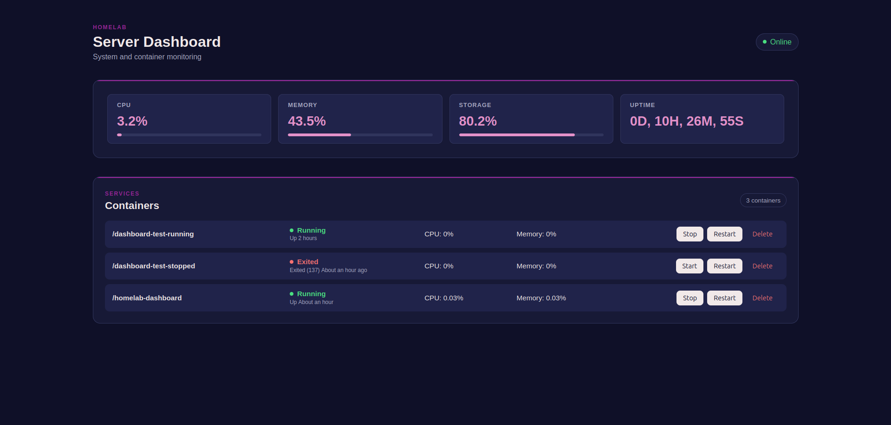

# Homelab Dashboard

A lightweight, self-hosted web dashboard for monitoring and managing Docker (or Podman) containers on a home server. Built in Go with no frontend framework — just server-rendered HTML templates and vanilla JS for live auto-refresh.




## Features

- **Container list** — name, state, and status for every container (running and stopped)
- **Per-container resource usage** — live CPU % and memory % via the Docker stats API
- **Container actions** — start, stop, restart, and delete containers directly from the browser
- **System metrics** — host CPU, memory, and storage usage, plus system uptime
- **Auto-refreshing UI** — container list and performance metrics poll and update every second, without a full page reload
- **Dark-themed, responsive layout** — works down to mobile widths

## How it works

The Go backend uses the [moby/moby client](https://github.com/moby/moby) to talk to the Docker (or Podman) socket. A background `Monitor` goroutine polls container state and resource stats every 5 seconds and caches the results in memory, so page loads and refresh polls stay fast and don't hammer the Docker API directly.

The frontend is rendered server-side with Go's `html/template`, split into `index`, `containers`, and `performance` template blocks. A small JavaScript loop hits `/containers` and `/performance` every second and swaps in the returned HTML fragments, giving a live-updating feel without any client-side framework.

Container actions (`start` / `stop` / `restart` / `delete`) are submitted as standard HTML forms to `/container/{action}`, validated server-side against the container's current state before anything is attempted.

## Requirements

- Access to a Docker or Podman socket on the host
- Docker / Podman Compose (recommended) or Go 1.26+ if building/running from source

## Getting started

### Option 1: Docker Compose (recommended)

Using `compose.yaml`, which pulls the published image and mounts a standard Docker socket:

```yaml
services:
  dashboard:
    image: ghcr.io/chesspiececat/homelab-dashboard:latest
    container_name: homelab-dashboard
    ports:
      - "8080:8080"
    volumes:
      - /var/run/docker.sock:/var/run/docker.sock
    restart: unless-stopped
```

```bash
docker compose -f compose.yaml up -d
```

The dashboard will be available at `http://<host>:8080`.

### Option 2: Podman (rootless)

If your host runs Podman instead of Docker, use `compose.podman.yaml`, which builds locally and mounts the Podman socket via `DOCKER_HOST`:

```yaml
services:
  dashboard:
    build: .
    container_name: homelab-dashboard
    ports:
      - "8080:8080"
    environment:
      - DOCKER_HOST=unix:///var/run/podman/podman.sock
    volumes:
      - ${XDG_RUNTIME_DIR}/podman/podman.sock:/var/run/podman/podman.sock
    security_opt:
      - label=disable
    restart: unless-stopped
```

```bash
docker compose -f compose.podman.yaml up -d
```

### Option 3: Build from source

```bash
git clone https://github.com/ChessPieceCat/Homelab-Dashboard.git
cd Homelab-Dashboard
go mod download
go run .
```

By default the app listens on `:8080` and connects to Docker using the standard environment-based configuration (`DOCKER_HOST`, etc.).

> **Security note:** mounting the Docker/Podman socket gives this container full control over the host's containers (including the ability to delete them). Only expose port 8080 on a trusted network, and don't run this behind a public-facing reverse proxy without adding authentication.

## Project structure

```
.
├── compose.podman.yaml       # Compose file for a Podman socket setup
├── compose.yaml               # Compose file for a standard Docker socket setup
├── Dockerfile                 # multi-stage build (Go builder -> Alpine runtime)
├── go.mod
├── go.sum
├── handlers.go                 # HTTP handlers (dashboard, container actions, partials)
├── handlers_test.go
├── internal
│   ├── docker
│   │   ├── docker.go           # Docker client, container listing, CPU/memory calculation
│   │   ├── docker_test.go
│   │   ├── monitor.go          # background polling + in-memory cache with RWMutex
│   │   └── monitor_test.go
│   └── system
│       ├── system.go           # host CPU/memory/storage usage, uptime formatting
│       └── system_test.go
├── main.go                    # entrypoint, route registration
├── main_test.go
├── LICENSE
├── README.md
├── TODO.md
└── web
    ├── containers.html         # container list partial
    ├── index.html              # base page template
    ├── performance.html        # system metrics partial
    ├── script.js                # polling/auto-refresh logic
    └── styles.css
```

## Development

Run the test suite:

```bash
go test ./...
go vet ./...
```

Tests cover CPU/memory percentage calculations, uptime formatting, the monitor's thread-safety guarantees, HTTP handlers, and template rendering.

## CI/CD

This project uses two GitHub Actions workflows:

- **`build-image.yml`** — on every push to `main` or a `feature/**` branch (and on PRs to `main`), runs `go test` and `go vet`, then builds a Docker image and pushes it to `ghcr.io/chesspiececat/homelab-dashboard`, tagged with the commit SHA and (on `main`) `latest`.
- **`deploy.yml`** — after a successful build on `main`, a self-hosted runner on the home server pulls the new image with `docker compose pull`, restarts the stack with `docker compose up -d`, and verifies the deployment with a health check against `http://localhost:8080`.

## Roadmap

- [x] Container listing with running/stopped state
- [x] Per-container CPU and memory usage
- [x] System-wide CPU/memory/storage usage and uptime
- [x] Start/stop container actions
- [x] Auto-refreshing UI
- [x] UI polish
- [ ] Authentication / access control
- [ ] Container logs viewer
- [ ] Multi-host support

## License

Licensed under the [MIT License](LICENSE).
